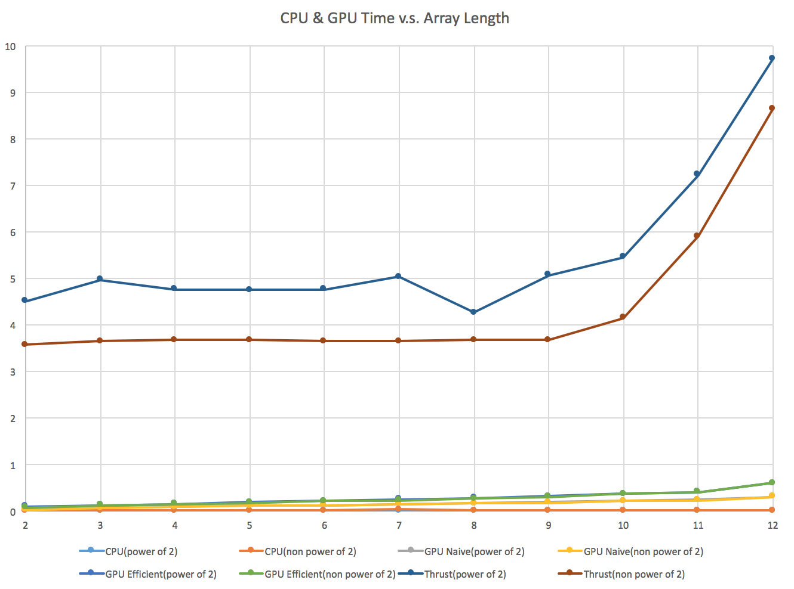

CUDA Stream Compaction
======================

**University of Pennsylvania, CIS 565: GPU Programming and Architecture, Project 2**

* Guan Sun
* Tested on: Mac OS X Yosemite 10.10.5, Intel Core i7 @ 2.3GHz 8GB, GeForce GT 650M 1024MB (Personal Laptop)

## Project Description:

In this project, the widely used GPU stream compaction is implemented in CUDA from scratch. The code of this project implemented the following:
* CPU Scan & Stream Campaction
* Naive GPU Scan Algorithm
* Work-Efficient GPU Scan & Stream Compaction
* Tested Thrust's Implementation

## Performance Analysis:

After optimizing the block sizes of each of the implementations for minimal run time. The comparision of different scan implementations are shown in the folloing figure. The X axis is the log of the array length, and the Y axis is the run time in ms.



* For the GPU Naive implemention, it needs to invoke the kernal funciton for `ilog2ceil(x)` times and each time the input data memory and output data memory on the GPU need to be swapped. This should be the bottleneck. 
* For the GPU Work-Efficient implementation, it need to sweep up first and then sweep down, that means it will need to invoke both of them `ilog2ceil(x)` times, and each time the input and output data memory also need to be swapped. Besides, after the up-sweep, the result need to be copied to host memory to insert 0 and then copy to device memory. All these factors limits the performance of the Work-Efficient implementation.
* For the Thrust's Implementation, since the run time is longer than all others, it is possible that there are time cosuming memory allocationa and memory copy operations inside it. While the time these operations in GPU Naive and GPU Work-Efficient are not included in the run time.


## Test Output:

```
****************
** SCAN TESTS **
****************
    [  30  41  15  22  11  41  10  37  48  41  44  30  26 ...  14   0 ]
==== cpu scan, power-of-two ====
CPU scan time is 0.0279 ms 
    [   0  30  71  86 108 119 160 170 207 255 296 340 370 ... 101214 101228 ]
==== cpu scan, non-power-of-two ====
CPU scan time is 0.0109 ms 
    [   0  30  71  86 108 119 160 170 207 255 296 340 370 ... 101145 101172 ]
    passed 
==== naive scan, power-of-two ====
GPU naive scan time is 0.3535 ms 
    [   0  30  71  86 108 119 160 170 207 255 296 340 370 ... 101214 101228 ]
    passed 
==== naive scan, non-power-of-two ====
GPU naive scan time is 0.4841 ms 
    [   0  30  71  86 108 119 160 170 207 255 296 340 370 ... 101172 101172 ]
    passed 
==== work-efficient scan, power-of-two ====
GPU work-efficient scan time is 1.8733 ms 
    [   0  30  71  86 108 119 160 170 207 255 296 340 370 ... 101214 101228 ]
    passed 
==== work-efficient scan, non-power-of-two ====
GPU work-efficient scan time is 1.7858 ms 
    [   0  30  71  86 108 119 160 170 207 255 296 340 370 ... 101145 101172 ]
    passed 
==== thrust scan, power-of-two ====
Thrust scan time is 12.0354 ms 
    [   0  30  71  86 108 119 160 170 207 255 296 340 370 ... 101214 101228 ]
    passed 
==== thrust scan, non-power-of-two ====
Thrust scan time is 10.5153 ms 
    [   0  30  71  86 108 119 160 170 207 255 296 340 370 ... 101145 101172 ]
    passed 

*****************************
** STREAM COMPACTION TESTS **
*****************************
    [   2   3   3   0   1   1   2   1   2   1   2   0   2 ...   0   0 ]
==== cpu compact without scan, power-of-two ====
    [   2   3   3   1   1   2   1   2   1   2   2   2   3 ...   3   1 ]
    passed 
==== cpu compact without scan, non-power-of-two ====
    [   2   3   3   1   1   2   1   2   1   2   2   2   3 ...   1   3 ]
    passed 
==== cpu compact with scan ====
CPU scan time is 0.0162 ms 
    [   2   3   3   1   1   2   1   2   1   2   2   2   3 ...   3   1 ]
    passed 
==== work-efficient compact, power-of-two ====
GPU work-efficient scan time is 0.5802 ms 
    [   2   3   3   1   1   2   1   2   1   2   2   2   3 ...   3   1 ]
    passed 
==== work-efficient compact, non-power-of-two ====
GPU work-efficient scan time is 0.5833 ms 
    [   2   3   3   1   1   2   1   2   1   2   2   2   3 ...   1   3 ]
    passed 
```